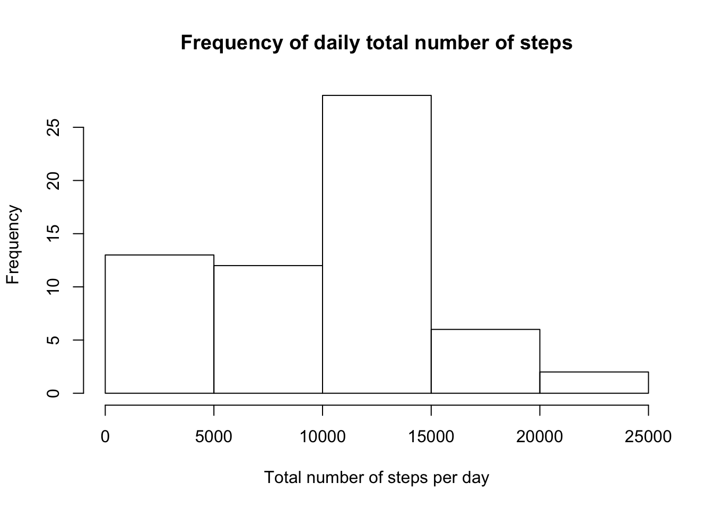
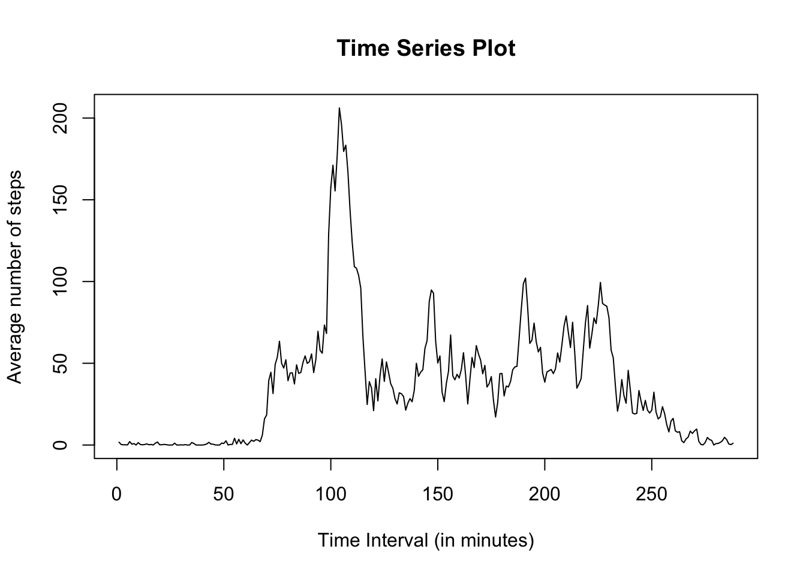
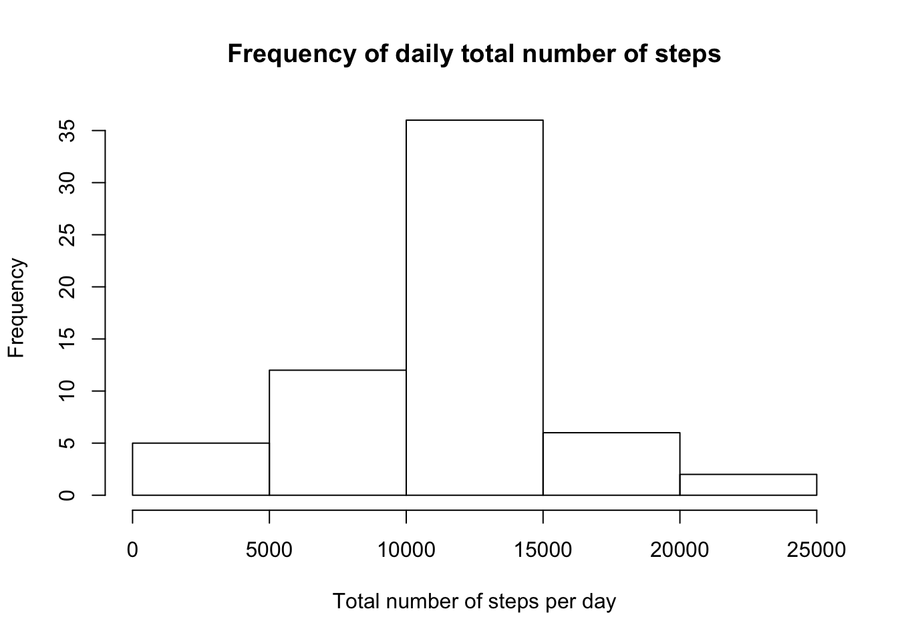
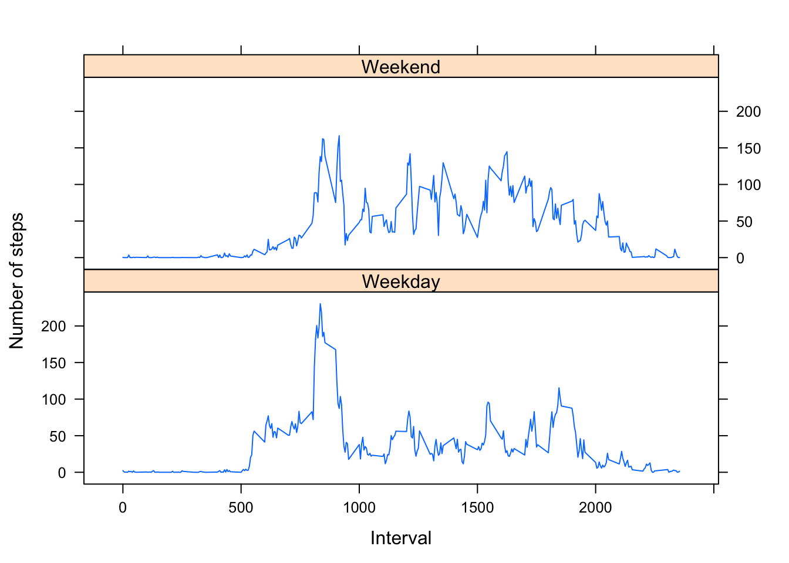

## Reading the data

The following code reads the data:


```r
dat <- read.csv("activity.csv")
head(dat)
```

```
##   steps       date interval
## 1    NA 2012-10-01        0
## 2    NA 2012-10-01        5
## 3    NA 2012-10-01       10
## 4    NA 2012-10-01       15
## 5    NA 2012-10-01       20
## 6    NA 2012-10-01       25
```

```r
#length(complete.cases(dat))
#length(!complete.cases(dat))
```

## Analyzing the data

### Part 1

What is mean total number of steps taken per day?

* For this part of the assignment, you can ignore the missing values in the dataset.

1. Calculate the total number of steps taken per day
2. If you do not understand the difference between a histogram and a barplot, research the difference between them. Make a histogram of the total number of steps taken each day
3. Calculate and report the mean and median of the total number of steps taken per day

Splitting the dataset on the basis of date such that data for each day is aggregated into one data frame.
Performing analysis on each day.


```r
drawHist <- function(dat)
{
ok <- complete.cases(dat)
cat("\nThe total number of rows with NAs:", length(ok[ok==FALSE]))

splitOnDate <- split(dat, dat$date)

#Calculating Totals steps per day
totalSteps <- lapply(splitOnDate, function(x){ sum(x$steps, na.rm = T)})


#Coercing list into data frame; In this the dates appear as row names. We want to convert it into a date column. Use the following code. This can also be done by first converting into a data frame and using setDT function from the data.table package

totalStepsPerDay <- data.frame(Date = names(totalSteps), DailyTotalSteps = unlist(totalSteps), row.names = NULL)

#Converting the first column into date type
totalStepsPerDay[[1]]<- as.Date(totalStepsPerDay[[1]], format = "%Y-%m-%d")

#totalStepsPerDay

hist(totalStepsPerDay$DailyTotalSteps, xlab = "Total number of steps per day", main = "Frequency of daily total number of steps")

cat("\nMean of total number of steps per day: ",mean(totalStepsPerDay$DailyTotalSteps))
cat("\nMedian of total number of steps per day: ",median(totalStepsPerDay$DailyTotalSteps))
}

drawHist(dat)
```

```
## 
## The total number of rows with NAs: 2304
```

<!-- -->

```
## 
## Mean of total number of steps per day:  9354.23
## Median of total number of steps per day:  10395
```

### Part 2

What is the average daily activity pattern?

1. Make a time series plot (i.e.  type = "l") of the 5-minute interval (x-axis) and the average number of steps taken, averaged across all days (y-axis)
2. Which 5-minute interval, on average across all the days in the dataset, contains the maximum number of steps?


```r
#Factoring as per the time interval
stepsPerInterval <- tapply(dat$steps, dat$interval, mean, na.rm=T)

#Plotting the results
plot(stepsPerInterval, type = "l", xlab = "Time Interval (in minutes)", ylab = "Average number of steps", main = "Time Series Plot")
```

<!-- -->

```r
cat("\nThe 5-minute interval that, on average across all the days in the dataset, contains the maximum number of steps: ",names(stepsPerInterval[which.max(stepsPerInterval)]))  
```

```
## 
## The 5-minute interval that, on average across all the days in the dataset, contains the maximum number of steps:  835
```


### Part 3

Imputing missing values

Note that there are a number of days/intervals where there are missing values (coded as NA). The presence of missing days may introduce bias into some calculations or summaries of the data.

1. Calculate and report the total number of missing values in the dataset (i.e. the total number of rows with NAs)
2. Devise a strategy for filling in all of the missing values in the dataset. The strategy does not need to be sophisticated. For example, you could use the mean/median for that day, or the mean for that 5-minute interval, etc.
3. Create a new dataset that is equal to the original dataset but with the missing data filled in.
4. Make a histogram of the total number of steps taken each day and Calculate and report the mean and median total number of steps taken per day. Do these values differ from the estimates from the first part of the assignment? What is the impact of imputing missing data on the estimates of the total daily number of steps?


```r
#Calculating number of missing cases
copyDat <- data.frame(dat)

ok <- complete.cases(dat)
cat("\nThe total number of rows with NAs in the original data:", length(ok[ok==FALSE]))
```

```
## 
## The total number of rows with NAs in the original data: 2304
```

```r
#Replace NAs with corresponding interval averages calculated above
for (i in 1:nrow(copyDat))
{
  if(is.na(copyDat$steps[i]))
    copyDat$steps[i] <- stepsPerInterval[[as.character(copyDat$interval[i])]]
}

#Drawing the histogram as was drawn above with the original copy of data which had NAs
drawHist(copyDat)
```

```
## 
## The total number of rows with NAs: 0
```

<!-- -->

```
## 
## Mean of total number of steps per day:  10766.19
## Median of total number of steps per day:  10766.19
```
* Yes; the values differ if we replace NAs in the original data with the average steps actoss all the occurances of the same interval. The data has more or less normal distribution. Also, the mean and the median are same.

### Part 4

For this part the weekdays() function may be of some help here. Use the dataset with the filled-in missing values for this part.

1. Create a new factor variable in the dataset with two levels – “weekday” and “weekend” indicating whether a given date is a weekday or weekend day.

2. Make a panel plot containing a time series plot (i.e. type = "l") of the 5-minute interval (x-axis) and the average number of steps taken, averaged across all weekday days or weekend days (y-axis). See the README file in the GitHub repository to see an example of what this plot should look like using simulated data.


```r
#Formatting the date column of the copied dataset into date type
copyDat$date <- as.Date(copyDat$date, format = "%Y-%m-%d")

#Inserting a new blank day column in the data set
if(length(copyDat)==3)
  copyDat$Day <- NA

#Inserting weekday/weekend where appropriate
for(i in 1:nrow(copyDat))
{
  dy <- weekdays(copyDat$date[i])
  if(dy=="Monday" | dy=="Tuesday" | dy=="Wednesday" | dy=="Thursday" | dy=="Friday")
    copyDat$Day[i] <- "Weekday"
  else
    copyDat$Day[i] <- "Weekend"
}

copyDat$Day <- factor(copyDat$Day)

#To find the mean of each of the intervals as per the day(Weekend | weekday). 'Aggregate' outputs a data frame which is easier to manipulate. We can split the dataset as per the day and then use tappply but the output is a list which again has to be conveted to data frame for the plot
stepsByDay <- aggregate(steps ~ interval + Day, data = copyDat, mean)

#Making the plot using lattice plotting system
xyplot(steps ~ interval | Day, stepsByDay, type = "l", layout = c(1, 2), 
    xlab = "Interval", ylab = "Number of steps")
```

<!-- -->

```r
#Making the plot using ggplot plotting system
#p <- ggplot(data = stepsByDay, aes(interval, steps)) + geom_line()
#p + facet_wrap(~Day,nrow = 2,ncol = 1)
```

